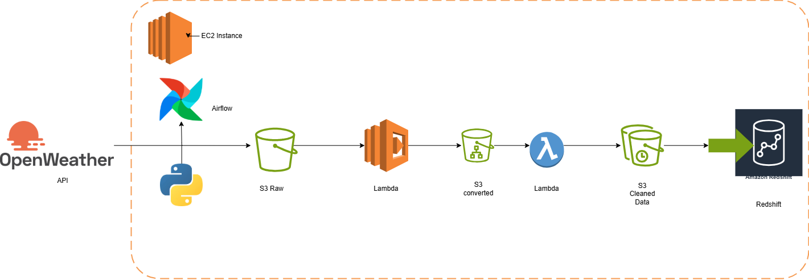

# 📗 My Open Weather Project

**Weather updates for 36 cities in Nigeria using OpenWeather API with Airflow, AWS Lambda, S3 Buckets, and Redshift**

Hello, This repository contains the code and resources for a data engineering project that collects weather data from the OpenWeather API and loads it through a fully automated ETL pipeline into AWS services for storage and analytics.

The objective for this project is to use airflow to automate the ETL process using open weather api and transferring the data to aws s3 bucket.Also, using lambda to copy the collected data to a new bucket to prevent the main data from external damages with another lambda function to help reduce the unncessary data collected which is to be transferred to a data warehouse(Redshift).

This project demonstrates practical data engineering skills including:

1. API ingestion

2. Cloud-native ETL pipelines

3. Serverless data processing

4. Workflow automation

---

## 📌 Table of Contents

- [Project Overview](#-project-overview)
- [Architecture](#-architecture)
- [Tools & Technologies](#-tools--technologies)
- [Project Workflow](#-project-workflow)
- [Repository Structure](#-repository-structure)
- [Setup & Installation](#-setup--installation)
- [Details by Component](#-details-by-component)
- [Redshift Schema](#-redshift-schema)

---

## 📌 Project Overview

This project implements an **end-to-end data engineering pipeline** that automatically extracts weather data for **36 Nigerian cities** using the **OpenWeather API**.

The pipeline:
- Extracts weather data from an external API
- Stores raw data in Amazon S3
- Processes and cleans data using AWS Lambda
- Loads transformed data into Amazon Redshift
- Orchestrates tasks using Apache Airflow

The processed data can later be used for analytics and visualization tools such as **Power BI**.

---

## 🧠 Architecture

High-level architecture of the pipeline:
OpenWeather API
↓
EC2 (Apache Airflow)
↓
Raw Weather CSV → S3 Bucket (Raw)
↓
AWS Lambda (File Transfer)
↓
S3 Bucket (Staging)
↓
AWS Lambda (Data Cleaning)
↓
S3 Bucket (Cleaned)
↓
Airflow → Amazon Redshift


---

## 🛠️ Tools & Technologies

| Category | Technology |
|--------|------------|
| Programming Language | Python |
| Workflow Orchestration | Apache Airflow |
| Cloud Platform | Amazon Web Services (AWS) |
| API Source | OpenWeather API |
| Storage | Amazon S3 |
| Serverless Processing | AWS Lambda |
| Data Warehouse | Amazon Redshift |
| Compute | AWS EC2 |

---

## 🔄 Project Workflow

1. **Data Extraction**
   - Airflow DAG triggers Python scripts that call the OpenWeather API.
   - Weather data for 36 Nigerian cities is retrieved in CSV format.

2. **Raw Data Storage**
   - Extracted data is uploaded into an Amazon S3 raw bucket.

3. **Lambda File Transfer**
   - A Lambda function moves files from the raw bucket to a staging bucket.

4. **Lambda Data Transformation**
   - Another Lambda function cleans the data by removing unnecessary columns.
   - Cleaned data is stored in a separate S3 bucket.

5. **Load to Redshift**
   - Airflow loads the cleaned data from S3 into Amazon Redshift tables.

---

## 📁 Repository Structure

My_open_weather_project/
│
├── dags/ # Apache Airflow DAG definitions
├── lambda/ # AWS Lambda function scripts
├── Weather_data_nigeria_*.csv # Sample weather datasets
├── Redshift_table.txt # Redshift table schema
└── README.md # Project documentation


---

## 🧩 Setup & Installation

### 1. OpenWeather API
- Register at https://openweathermap.org/api
- Generate an API key

### 2. AWS Infrastructure
- Create an EC2 instance (Ubuntu recommended)
- Attach IAM role with permissions for:
  - Amazon S3
  - AWS Lambda
  - Amazon Redshift

### 3. Airflow Setup
- Install Apache Airflow on the EC2 instance
- Configure DAGs inside the `dags/` directory
- Start Airflow webserver and scheduler

---

## 📦 Details by Component

### Apache Airflow (DAGs)

The `dags` folder contains workflows that:
- Call the OpenWeather API
- Upload CSV files to S3
- Monitor S3 file availability using sensors
- Load cleaned data into Redshift

Airflow operators used include:
- `PythonOperator`
- `BashOperator`
- `S3KeySensor`
- `S3ToRedshiftOperator`

---

### AWS Lambda

Two Lambda functions are implemented:

1. **TransferFile Lambda**
   - Moves raw weather data from the raw S3 bucket to a staging bucket.

2. **ConvertFile Lambda**
   - Cleans and transforms the dataset.
   - Outputs cleaned data into a bucket ready for Redshift loading.

---

## 📊 Redshift Schema

The Redshift table schema is defined in `Redshift_table.txt`.

Example structure:

```sql
city VARCHAR(50),
temperature FLOAT,
humidity INTEGER,
pressure INTEGER,
weather_description VARCHAR(100),
timestamp TIMESTAMP,
Longitude DECIMAL,
latitude DECIMAL,
Weather_description VARCHAR(255),
Wind_speed DECIMAL,
Wind_direction NUMERIC,
Pressure NUMERIC,
Humidity NUMERIC,
Temperature DECIMAL,
Mininum_temperature DECIMAL,
Maximum_temperature DECIMAL
```
